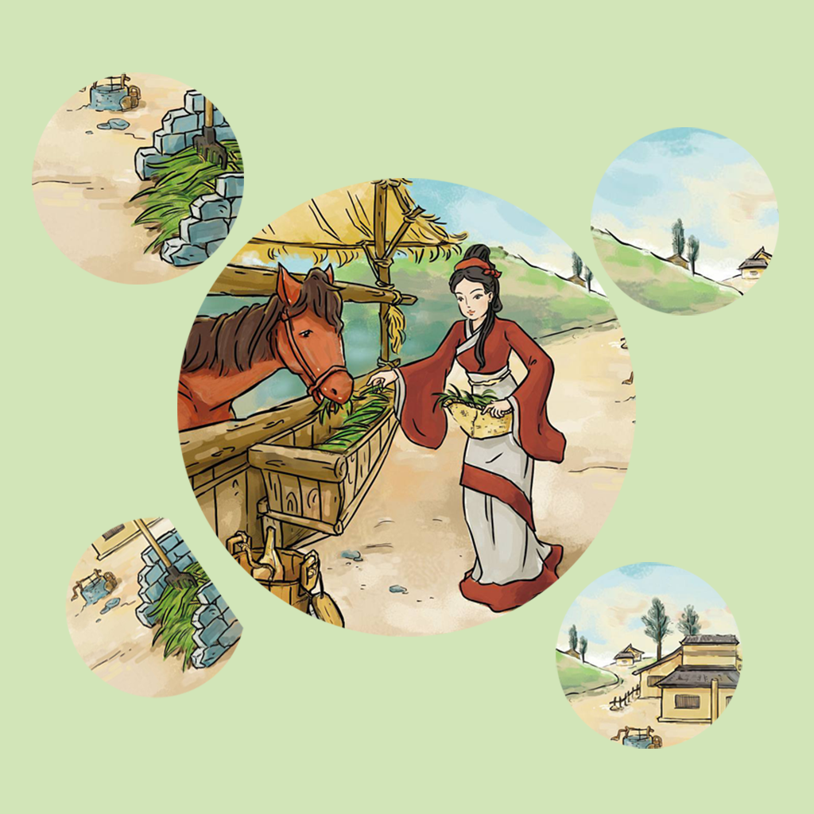

## Welcome to My Horse Eats Grass Record

Have you ever had a horse that didn't like to eat grass sometimes, or ate so little that it lost a lot of weight? If you've had a similar problem, you can use this app to help you solve it. You can keep track of the type of grass your horse eats, and where it eats more grass, in the mountains, in the fields, etc. You can also record the mood and health of the horse as it grazes. You can keep track of these at different times so you know what kind of grass your horse likes to eat, helping you keep your horse healthy.

If you have any questions, you can either leave a message or send the questions to our email address.

We will answer them for you in the first time.

### Address: sun778297ma@163.com

Thank you!
